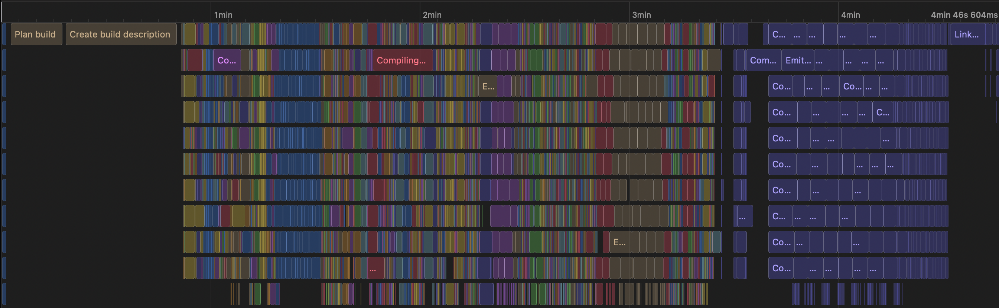
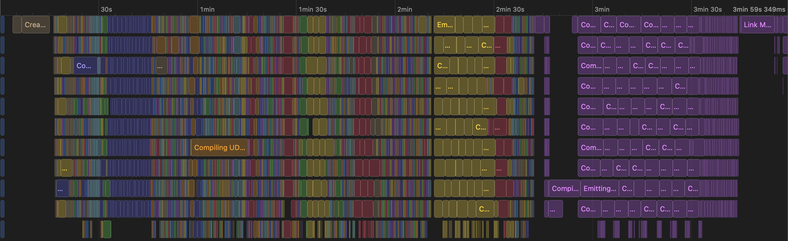

+++
title = "Is it worth it to have DerivedData on a RAM disk?"
description = "Explore Xcode build performance improvements with DerivedData on a RAM disk"
date = 2023-11-05
[taxonomies]
tags = ["xcode", "performance", "ram-disk"]
+++

As you probably know, Xcode stores intermediate build files and indexes in
`DerivedData` directory, `~/Library/Developer/Xcode/DerivedData` to be precise.
It helps improve build performance by caching previously built artifacts
and allowing for incremental builds. One of the ways to improve Xcode build
times is to create a virtual disk in memory (RAM disk) and mount it in place
of `DerivedData` directory. With modern Apple devices this becomes somewhat
possible and I've decided to try it out.

I have M1 Max MacBook Pro with 64 GB of memory. Usually, I don't consume all of
the memory during development, so I can put aside some for a RAM disk.

## Creating a RAM disk

I will use terminal and available tools to create a RAM disk with a file system
and mount it.

1. Creating a disk

```bash
hdiutil attach -nomount ram://33554432
```

The magic number is `blockcount`, one block is 512 bytes, so 33554432 is around
17 GB.

This will return something like `/dev/disk4`. 

> Note, that the disk index can be different for you, so adjust the following
commands accordingly.

You can verify the disk has been created by running `hdiutil info`. Also, at any
point you can get rid of the disk by running `hdiutil eject /dev/disk4`

2. The disk doesn't have a file system, we need to create one. I will create
APFS but you can explore others

```bash
newfs_apfs -v DerivedData /dev/disk4
```

`DerivedData` here is the name of the volume. It could be anything and will be
visible in Finder as an external disk.

Let's check the result by running `diskutil list`:

```
<omitted>

...

/dev/disk4 (disk image):
   #:                       TYPE NAME                    SIZE       IDENTIFIER
   0:                                                   +17.2 GB    disk4

/dev/disk5 (synthesized):
   #:                       TYPE NAME                    SIZE       IDENTIFIER
   0:      APFS Container Scheme -                      +17.2 GB    disk5
                                 Physical Store disk4
   1:                APFS Volume DerivedData             20.5 KB    disk5s1
```

You should see created `DerivedData` volume with `disk5s1` identifier. We need
that for the last step.

3. Mounting to `DerivedData`

```bash
mount_apfs /dev/disk5s1 Library/Developer/Xcode/DerivedData
```

That's all. The RAM disk is successfully created and mounted.

## Measuring Xcode build performance

As a benchmark I took our current work project, decent size, takes around 5
minutes to build.

The following results are after second clean build for both. Please take these
timings with a grain of salt. I don't trust these numbers myself :). On several
runs I've even noticed there are no improvements in time.

### DerivedData is on SSD disk

_4min 47s_



### DerivedData is on RAM disk

_3min 59s_



## In conclusion

Though, numbers show that the RAM disk is faster, in reality I'd argue that
it hardly matters for local builds. I'd like to measure performance for
incremental builds but it's hard to do correctly and there will be a lot more
variables involved. Modern SSDs are fast enough that it's very hard to justify
inconveniences of creating and managing a RAM disk. For bigger projects it's
even impossible to create big RAM disks without going into 128 GB territory.

As for myself, I've decided to run this setup for a week or two to see if it
feels faster.

[Discuss on Reddit](https://www.reddit.com/r/iOSProgramming/comments/17og1nm/is_it_worth_it_to_have_deriveddata_on_a_ram_disk/)
